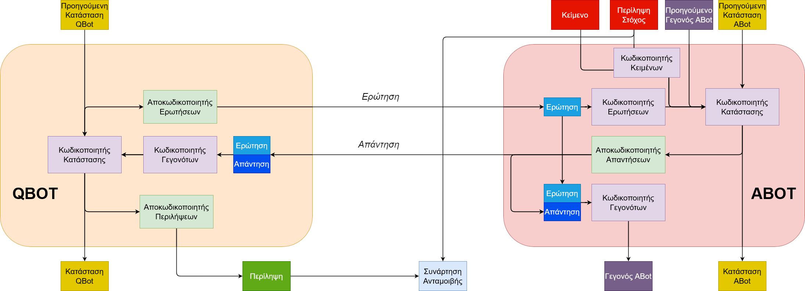

# Γλωσσική Ανάπτυξη σε Πολυπρακτορικά Συστήματα - Language Creation in Multi-Agent Systems
Αυτό το repository δημιουργήθηκε για τον κώδικα που αναπτύχθηκε για την διπλωματική μου εργασία με τίτλο "Γλωσσική Ανάπτυξη σε Πολυπρακτορικά Συστήματα - Language Creation in Multi-Agent Systems".

Ο κώδικας και η αρχιτεκτονική της εργασίας βασίστηκε στην εργασία 
**[ batra-mlp-lab / visdial-rl ](https://github.com/batra-mlp-lab/visdial-rl)** 

Στην παρούσα εργασία πραγματοποιείται ανάπτυξη και μελέτη ενός συνεργατικού πολυπρακτορικού μερικώς παρατηρήσιμου συστήματος με στόχο την παραγωγή και βελτίωση περιλήψεων κειμένων μέσω διαλόγου με μηνύματα σε μορφή φυσικής γλώσσας. Το σύστημα αποτελείται από δύο πράκτορες, έναν που κάνει ερωτήσεις και έναν που απαντάει σε αυτές με βάση το κείμενο και την προτεινόμενη περίληψη (περίληψη-στόχος). Ο ρόλος του πράκτορα ερωτήσεων είναι η δημιουργία περίληψης η οποία είναι σημασιολογικά κοντά στην περίληψη-στόχο χωρίς να έχει πρόσβαση σε αυτή παρά μόνο μέσω της ανάπτυξης διαλόγου. Ο ρόλος του πράκτορα απαντήσεων είναι να κατευθύνει την παραγωγή περίληψης μεταφέροντας τα σημαντικά σημεία του κειμένου, υποβοηθούμενος από την περίληψη-στόχο και το κείμενο, στον συνεργάτη του, δηλαδή λειτουργεί σαν ένας δάσκαλος που κατευθύνει τον μαθητή του απαντώντας στις ερωτήσεις του. Ο στόχος των πρακτόρων είναι κοινός, και για αυτό το λόγο καλούνται να συνεργαστούν για την βελτίωση της παραγόμενης περίληψης. Η αρχιτεκτονική της εργασίας δίνει μεγάλη έμφαση στο διαλογικό σύστημα των δύο πρακτόρων.



## Εγκατάσταση
Χρησιμοποιήθηκε η [Python 3.6](https://www.python.org/downloads/release/python-364/) για την ανάπτυξη και εκτέλεση του κώδικα σε λειτουργικό σύστημα Linux (WSL2), ενώ είναι δυνατή η εκτέλεση του demo και σε [Python 3.9](https://www.python.org/downloads/release/python-3915/) σε λειτουργικό σύστημα Windows.

Ο κώδικας υλοποιήθηκε σε τη χρήση του framework [PyTorch](https://pytorch.org/).
Οδηγίες εγκατάστασης:
1. Εγκατάσταση [Python 3.6](https://www.python.org/downloads/release/python-364/)
2. Εγκατάσταση [PyTorch](https://pytorch.org/), στην οποία προτείνεται η χρήση CUDA για γρηγορότερη εκτέλεση.
3. Clone το αυτό το repository 
```
git clone https://github.com/L4Limbo/lc_mas_torch
cd lc_mas_torch
```
4. Δημιουργία env `lc_mas_torch` για την εγκατάσταση των απαιτούμενων βιβλιοθηκών με τη χρήση [Anaconda](https://anaconda.org/anaconda/python):
```
conda env create -f environment.yml
```
6. (Προεραιτικά) Για Windows δημιουργία env μέσω [Anaconda](https://anaconda.org/anaconda/python) και εγκατάσταση του αρχείου [requirements_demo.txt](requirements_demo.txt)
```
conda create -n lcenv python=3.9 anaconda
source activate lcenv
pip install -r requirements_demo.txt

```
7. Λήψη Δεδομένων και τοποθέτηση στον σωστό φάκελο για διευκόλυνση του χρήστη από το [Google Drive](https://drive.google.com/drive/folders/1KhnPHy-1bjA_HO6mtfhXvbavVCNTLGoX?usp=share_link):
  8. Λήψη του φακέλου `\lc_mas_torch_public\data\`. Τα δεδομένα προέρχονται από το dataset [Question-Driven Summarization of Answers to Consumer Health Questions](https://osf.io/fyg46/?view_only=).
  9. Αντικατάσταση του φακέλου `data\` του project τοπικά με τον φάκελο που κατέβηκε από το Google Drive.

## Χρήση
### Δημιουργία Δεδομένων
Η δημιουργία δεδομένων έγινε με τη χρήση του αρχείου [data_gen.ipynb](data_gen.ipynb) στο περιβάλλον [Google Colab](https://colab.research.google.com) με χρήση GPU. Τα δημιουργημένα δεδομένα βρίσκονται στο φάκελο `data\generated_data`.

### Προεπεξεργασία Δεδομένων
Για την προεπεξεργασία δεδομένων απαιτείται να έχουν ληφθεί οι φάκελοι `data/generated_data` και `data/word2vec` από το Google Drive του βήματος 7 των οδηγιών εγκατάστασης. Εκτέλεση του παρακάτω κώδικα για την δημιουργία των δεδομένων εκπαίδευσης και αξιολόγησης, τα οποία υπάρχουν ήδη στο φάκελο `data/processed_data`.
```
cd data
python lc_prepro.py
cd ..
```

### Εκπαίδευση
Το project υποστηρίζει επιβλεπόμενη εκπαίδευση των δύο πρακτόρων `sl-abot` και `sl-qbot` καθώς και ενισχυτική εκπαίδευση τους `rl-full-QAf`.
Τα αρχεία των προεκπαιδευμένων μοντέλων υπάρχουν στο [Google Drive](https://drive.google.com/drive/folders/1KhnPHy-1bjA_HO6mtfhXvbavVCNTLGoX?usp=share_link) στο φάκελο `checkpoints`. Μετά την λήψη τους τοποθετούνται στον αρχικό φάκελο του project.
Οι παράμετροι για την εκπαίδευση ορίζονται στο αρχείο [options.py](options.py).

Για την επιβλεπόμενη εκπαίδευση του πράκτορα των απαντήσεων ABot ορίζεται ως `-trainMode` η τιμή `sl-abot`.
Για την επιβλεπόμενη εκπαίδευση του πράκτορα των ερωτήσεων QBot ορίζεται ως `-trainMode` η τιμή `sl-qbot`.
Για την ενισχυτική εκπαίδευση των δύο πρακτόρων ορίζεται ως `-trainMode` η τιμή `rl-full-QAf` και ως συνάρτηση ανταμοιβής `-simFunction` μία από τις τιμές της λίστας `['rouge', 'levenshtein', 'word2vec', 'self_critic']`.
Με την τιμή `rouge` η συνάρτηση ανταμοιβής υπολογίζεται με βάση την μετρική ROUGE.
Με την τιμή `levenshtein` η συνάρτηση ανταμοιβής υπολογίζεται με βάση την ομοιότητα κανονικοποιημένης απόστασης Levenshtein.
Με την τιμή `word2vec` η συνάρτηση ανταμοιβής υπολογίζεται με βάση την ομοιότητα συνημίτονων στο σύστημα Word2Vec.
Με την τιμή `self_critic` η συνάρτηση ανταμοιβής υπολογίζεται με βάση την μετρική ROUGE και τη χρήση αυτοκριτικής στην παραγωγή περιλήψεων.

Αφού οριστούν οι παράμετροι της εκπαίδευσης εκτελείται η εντολή:
```
python train.py -useGPU
```

Σε περίπτωση διακοπής της εκπαίδευσης ορίζονται στις τιμές του αρχείου `options.py` οι τιμές `-startFrom` και `-qstartFrom` με τα αρχεία που έχουν αποθηκευτεί τα βάρη από τα οποία θα συνεχιστεί η εκπαίδευση. Εκτελείται η εντολή:
```
python train.py -useGPU -continue
```

### Demo
Στο αρχείο [demo.ipynb](demo.ipynb) γίνεται επίδειξη της λειτουργίας του συστήματος. Προτείνεται να επιλεχθεί το env lcenv που δημιουργήθηκε για την εκτέλεση του demo ή οποιοδήποτε άλλο περιβάλλον στο οποίο είναι εγκατεστημένες οι απαιτήσεις του project.

### Διαγράμματα Εκπαίδευσης και Αξιολόγησης
Τα διαγράμματα εκπαίδευσης και αξιολόγησης μαζί με τα δεδομένα που τα δημιουργούν υπάρχουν στο [Google Colab](https://colab.research.google.com) στους φακέλους `plots` και `plot_data`, αντίστοιχα και χρησιμοποιούνται στο αρχείο [pg_plots.ipynb](pg_plots.ipynb).


